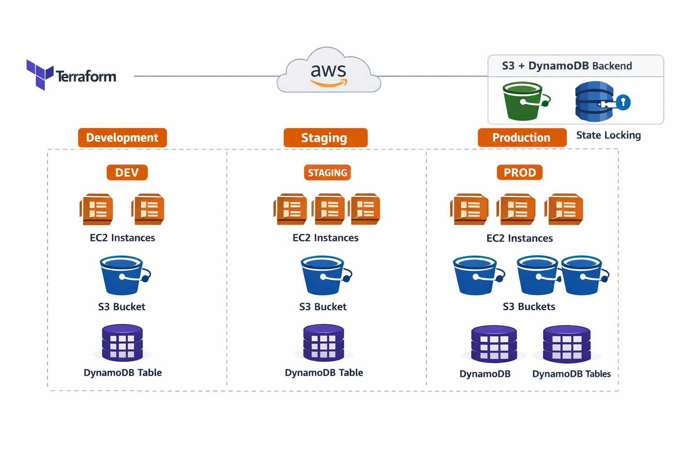

<!-- Banner -->

<div align="center">


<br/>

# 🏗️ Terraform AWS — Multi-Environment Infrastructure

**A hands-on DevOps learning project evolving from basics → real-world Terraform architecture**

`modular architecture` · `workspaces` · `remote backends` · `scalable IaC`

<br/>

[](https://www.terraform.io/)
[](https://aws.amazon.com/)
[]()

</div>

---

## 🗺️ What This Repository Is

This repository represents my **complete Terraform learning journey** — starting from basic resource creation to building a **multi-environment, modular infrastructure setup** similar to real-world DevOps systems.

I didn’t just follow tutorials — I:
- Built things from scratch  
- Broke configurations  
- Debugged real errors  
- Understood how Terraform actually works internally  

> 🎯 **Goal:** Design scalable, reusable, and environment-aware infrastructure using Terraform.

---

## 🧠 What I Practiced & Learned

### 🔹 Terraform Fundamentals
- EC2, S3, DynamoDB resource creation  
- Provider configuration  
- Variables (`variables.tf`)  
- Outputs (`output.tf`)  

### 🔹 Intermediate Concepts
- Local variables (`locals`)  
- `count` for scaling resources  
- Conditional expressions  
- Workspace-based deployments  

### 🔹 Advanced Concepts
- Terraform modules (reusable infra)  
- Multi-environment architecture (Dev / Stg / Prd)  
- Remote backend:
  - S3 → state storage  
  - DynamoDB → state locking  
- Importing existing infrastructure (`terraform import`)  
- Managing instance state (`aws_ec2_instance_state`)  

---

## 📂 Repository Structure

```
.
├── 🌟 terraform-aws-multi-environment-project/   ← MAIN PROJECT (START HERE)
│   ├── main.tf
│   ├── variables.tf
│   ├── provider.tf
│   ├── terraform.tf
│   └── modules/
│       ├── ec2/
│       ├── s3/
│       └── dynamodb/
│
├── terraform-advance-practise/                   ← Advanced Terraform concepts
├── remote-backends/                              ← Backend (S3 + DynamoDB)
├── ec2.tf                                        ← Basic EC2 practice
├── s3.tf                                         ← Basic S3 practice
└── terra-automate-key.pub                        ← SSH public key
```

---

## ⭐ Main Project: Multi-Environment Infrastructure

📁 **Location:**  
`terraform-aws-multi-environment-project/`

This is the **core project of this repository** where I implemented:

- Modular Terraform architecture  
- Workspace-based environment separation  
- Dynamic infrastructure scaling  

---

## 🧠 Architecture Overview



### 📊 Environment Scaling

| Environment | EC2 Instances | S3 Buckets | DynamoDB Tables |
|:-----------:|:-------------:|:----------:|:---------------:|
| `dev`       | 2             | 1          | 1               |
| `stg`       | 3             | 1          | 1               |
| `prd`       | 4             | 2          | 2               |

---

## ⚙️ How Environment Switching Works

Terraform uses **workspaces**:

```
dev → stg → prd
```

Dynamic configuration using locals:

```hcl
locals {
  env = {
    dev = { instance_count = 2 }
    stg = { instance_count = 3 }
    prd = { instance_count = 4 }
  }

  current = lookup(local.env, terraform.workspace, local.env["dev"])
}
```

👉 One codebase → multiple environments → zero duplication 🚀

---

## 🧱 Module Breakdown

### 🔸 modules/ec2
- Creates EC2 instances  
- Uses dynamic scaling (`count`)  
- Configures:
  - Security groups  
  - Key pairs  
  - Root volumes  
- Outputs public IP & DNS  

---

### 🔸 modules/s3
- Creates S3 buckets per environment  
- Uses environment-based naming convention  

---

### 🔸 modules/dynamodb
- Creates DynamoDB tables  
- Used for:
  - Backend state locking  
  - Scalable infra design  

---

## 🔧 Remote Backend — `remote-backends/`

Terraform state is stored remotely:

```hcl
backend "s3" {
  bucket         = "my-terraform-backend-bucket-dhurandaar"
  dynamodb_table = "my-terraform-backend-table"
  key            = "terraform.tfstate"
  region         = "ap-south-1"
}
```

| Component | Purpose |
|----------|--------|
| S3       | Stores Terraform state |
| DynamoDB | Prevents concurrent state conflicts |

---

## 🧪 Advanced Practice — `terraform-advance-practise/`

This folder contains deeper Terraform experiments:

- `terraform import` → Manage existing AWS resources  
- `aws_ec2_instance_state` → Control instance lifecycle  
- Local variables & conditionals  
- Debugging real Terraform errors  

---

## 🚀 Running the Project

```bash
terraform init

terraform workspace new dev
terraform workspace new stg
terraform workspace new prd

terraform workspace select dev

terraform plan
terraform apply
```

---

## 🧠 Key DevOps Takeaways

- Infrastructure should be **modular and reusable**  
- State management is **critical in team environments**  
- Multi-environment setups must be **scalable and dynamic**  
- Terraform is **declarative, not imperative**  

---

## 🔐 Security Note

⚠️ Never commit private keys to GitHub  

Add to `.gitignore`:

```
*.pem
terra-automate-key
```

---

## 📈 Future Improvements

- Custom VPC module  
- IAM roles for EC2  
- CI/CD integration  
- user_data automation  
- CloudWatch monitoring  

---

## 👤 Author

**Aniruddha Kharve**  
Aspiring Cloud & DevOps Engineer 🚀  

---

<div align="center">

⭐ If this project helped you, consider giving it a star!

**Built → Broken → Debugged → Learned → Improved 🔥**

</div>
